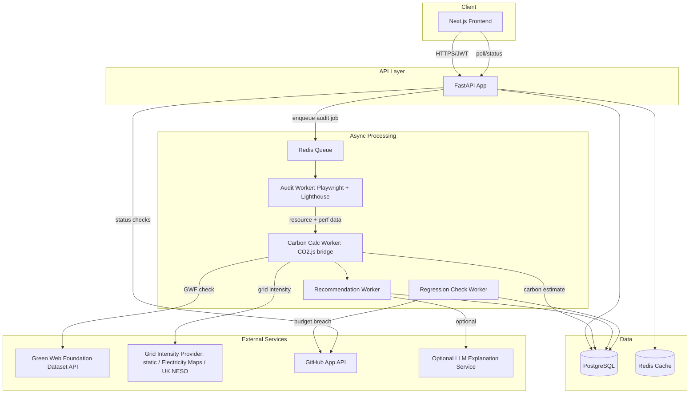
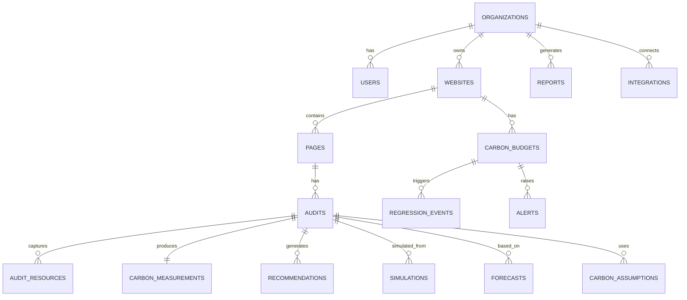

# Carbonerra — Backend Architecture Specification

Stack: Python + FastAPI + SQLAlchemy + PostgreSQL + Alembic + Playwright + Lighthouse (via CLI/Node subprocess) + Redis + Celery (or Arq) for background jobs + Docker.

---

## 1. System Architecture Diagram



---

## 2. Backend Folder Structure (Domain-Driven)

```
/app
  main.py                       # FastAPI app factory, router registration
  config.py                     # Settings (pydantic-settings), env-driven
  /api
    /v1
      routers/
        auth.py, orgs.py, websites.py, audits.py, hotspots.py,
        recommendations.py, carbon_lab.py, forecasts.py, budgets.py,
        regressions.py, reports.py, integrations.py, webhooks.py
      deps.py                    # shared FastAPI dependencies (auth, db session, org scoping)
  /domain
    /audits          models.py, schemas.py, service.py
    /carbon           models.py, schemas.py, engine.py, uncertainty.py, versioning.py
    /hosting           green_check.py, grid_intensity.py (provider abstraction)
    /recommendations   rules/ (individual rule modules), engine.py, schemas.py
    /simulation         engine.py, schemas.py
    /forecasting         engine.py, scenarios.py, schemas.py
    /budgets              models.py, service.py, regression_detector.py
    /reports               generator.py, templates/
    /orgs                   models.py, service.py, rbac.py
    /users                    models.py, service.py
  /workers
    audit_worker.py, carbon_worker.py, recommendation_worker.py,
    regression_worker.py, celery_app.py (or arq_app.py)
  /infra
    db.py (engine/session), redis.py, cache.py, storage.py, logging.py, tracing.py
  /security
    ssrf.py, jwt.py, rbac.py, secrets.py
  /integrations
    playwright_runner.py, lighthouse_runner.py, github_app.py, llm_client.py
  /migrations                    # Alembic
/tests
  unit/, integration/, e2e/
docker-compose.yml, Dockerfile.api, Dockerfile.worker
```

---

## 3. API Versioning Strategy

- URL-prefixed versioning (`/v1/...`) from day one; breaking changes ship as `/v2` routers running alongside `/v1` during a deprecation window, never in-place breaking changes to a live version.
- Response schemas are explicit Pydantic models (never raw ORM serialization) so internal model changes don't silently change the public contract.

---

## 4. Authentication & Authorization Design

- JWT access tokens (short-lived, ~15 min) + refresh tokens (httpOnly cookie, ~14 days, rotated on use).
- Password hashing via `argon2` (or `bcrypt` as a documented fallback).
- MVP: single role per org (owner). v2: RBAC roles `owner/admin/member/viewer` enforced via a FastAPI dependency (`require_role(min_role)`) checked against the requesting user's `OrganizationMembership` row, not just their account.
- GitHub App installation tokens stored encrypted at rest, scoped to the minimum permissions needed (checks:write, pull_requests:write) — never a personal access token with broad repo scope.

---

## 5. Multi-Tenant Organization / Workspace Model

- Every domain row (Website, Audit, Budget, Report, Integration) carries an `organization_id` foreign key; all queries scoped by the authenticated user's current organization context (enforced centrally in `deps.py`, not ad hoc per-router) to prevent cross-tenant data leakage.
- MVP ships with exactly one organization per new signup (auto-created), keeping the data model multi-tenant-ready without requiring the UI to expose org-switching yet.

---

## 6. Database Schema



| Table | Key columns |
|---|---|
| `users` | id, email, hashed_password, name, created_at |
| `organizations` | id, name, slug, created_at |
| `organization_memberships` | id, org_id, user_id, role, created_at |
| `websites` | id, org_id, root_url, name, created_at |
| `pages` | id, website_id, url, label, created_at |
| `audits` | id, page_id, status, device_profile, network_profile, crawl_depth, methodology_version, created_at, completed_at, error_detail |
| `audit_resources` | id, audit_id, url, category, transfer_bytes, request_count, cached_bool, initiator |
| `carbon_measurements` | id, audit_id, per_visit_g, per_visit_range_low, per_visit_range_high, per_1000_views_g, monthly_projection_g, annual_projection_g, methodology_version, calculated_at |
| `carbon_assumptions` | id, audit_id, grid_intensity_device, grid_intensity_datacenter, green_hosting_bool, data_reload_ratio, first_visit_pct, return_visit_pct |
| `recommendations` | id, audit_id, rule_id, priority, title, cause_explanation, evidence_json, impact_range_low, impact_range_high, effort, confidence, code_snippet, category, status |
| `simulations` | id, audit_id, input_levers_json, baseline_carbon_g, target_carbon_g, created_by_user_id, created_at |
| `carbon_budgets` | id, website_id, scope ("page"/"project"), threshold_g, alert_channel, created_at |
| `regression_events` | id, budget_id, audit_id, previous_audit_id, delta_pct, severity, resource_deltas_json, resolved_bool, detected_at |
| `alerts` | id, org_id, type, payload_json, delivered_bool, created_at |
| `forecasts` | id, audit_id, assumptions_json, scenarios_json, created_at |
| `reports` | id, org_id, scope_json, audience, share_token, expires_at, created_at |
| `integrations` | id, org_id, type ("github"/"grid_intensity_provider"), config_json (secrets referenced, not stored inline), status, connected_at |

**Key indexes:** `audits(page_id, created_at DESC)` for history queries; `audit_resources(audit_id, category)` for hotspot aggregation; `regression_events(budget_id, detected_at DESC)`; `carbon_measurements(audit_id)` unique; `reports(share_token)` unique for public report lookup.

**SQLAlchemy model design guidance:** use declarative models per domain module (not one monolithic `models.py`), `Mapped[...]`/`mapped_column` typed style (SQLAlchemy 2.0), explicit `relationship()` with `lazy="selectin"` for commonly-joined children (e.g., `Audit.resources`) to avoid N+1s on hotspot pages, and a shared `TimestampMixin` for `created_at`/`updated_at`.

---

## 7. API Endpoint Table (representative set; full contract in `api_contracts.md`)

| Endpoint | Method | Auth | Request | Response | Error behavior |
|---|---|---|---|---|---|
| `/v1/auth/signup` | POST | none | email, password, org_name | user + tokens | 400 validation, 409 email exists |
| `/v1/auth/login` | POST | none | email, password | tokens | 401 invalid credentials |
| `/v1/websites` | POST | JWT | root_url, name | website | 400 invalid URL, 403 SSRF-blocked |
| `/v1/websites/{id}/audits` | POST | JWT | device, network, crawl_depth | `{audit_id, status}` | 400 invalid config, 429 rate-limited |
| `/v1/audits/{id}/status` | GET | JWT | — | `{status, step, progress_pct}` | 404 not found |
| `/v1/audits/{id}` | GET | JWT | — | full `AuditResult` | 404, 425 (too early — not complete) |
| `/v1/audits/{id}/hotspots` | GET | JWT | query: category filter | resource list | 404 |
| `/v1/audits/{id}/recommendations` | GET | JWT | — | recommendation list | 404 |
| `/v1/audits/{id}/simulate` | POST | JWT | lever inputs | simulation result | 400 out-of-bounds levers |
| `/v1/websites/{id}/forecast` | POST | JWT | assumption overrides (optional) | forecast scenarios | 400 invalid assumptions |
| `/v1/websites/{id}/budget` | PUT | JWT | scope, threshold_g | budget | 400 invalid threshold |
| `/v1/websites/{id}/regressions` | GET | JWT | — | regression event list | 404 |
| `/v1/reports` | POST | JWT | scope, audience | report + share link | 400 |
| `/v1/reports/{share_token}` | GET | **public** (token-gated) | — | rendered report | 404/410 expired |
| `/v1/integrations/github/callback` | GET | JWT (state-verified) | OAuth code | connection status | 400 state mismatch |
| `/v1/webhooks/github` | POST | GitHub signature | deployment/PR event | 200 ack | 401 bad signature |

---

## 8. Pydantic Request/Response Schemas (representative)

```python
class AuditConfigRequest(BaseModel):
    device: Literal["desktop", "mobile"] = "desktop"
    network: Literal["broadband", "4g", "slow-3g"] = "broadband"
    crawl_depth: int = Field(default=1, ge=1, le=10)

class CarbonEstimateResponse(BaseModel):
    value_grams: float
    range_low_grams: float
    range_high_grams: float
    methodology_version: str
    calculated_at: datetime

class AuditResultResponse(BaseModel):
    id: UUID
    website_id: UUID
    url: str
    status: Literal["queued", "running", "completed", "failed", "partial"]
    summary: AuditSummary
    hosting: HostingInfoResponse
    carbon: CarbonBreakdownResponse
    eco_score: EcoScoreResponse
    resources: list[ResourceItemResponse]

class RecommendationResponse(BaseModel):
    id: UUID
    rule_id: str
    priority: Literal["P0", "P1", "P2"]
    title: str
    cause_explanation: str
    evidence: list[EvidenceItem]
    estimated_impact: ImpactRange
    effort: Literal["low", "medium", "high"]
    confidence: Literal["low", "medium", "high"]
    code_snippet: str | None = None
```

---

## 9. Audit Job Lifecycle

```mermaid
sequenceDiagram
    participant API
    participant Queue
    participant Worker as Audit Worker
    participant PW as Playwright
    participant LH as Lighthouse
    participant GWF as Green Web Foundation
    participant Calc as Carbon Calc Engine
    participant DB

    API->>API: Validate URL (SSRF check, format, reachability)
    API->>DB: Create Audit row (status=queued)
    API->>Queue: Enqueue audit job
    Queue->>Worker: Dequeue
    Worker->>DB: status=running, step=crawling
    Worker->>PW: Launch headless browser, navigate, capture network log
    PW-->>Worker: Resource list, timings, DOM/asset data
    Worker->>DB: status=running, step=lighthouse
    Worker->>LH: Run Lighthouse audit
    LH-->>Worker: Performance/accessibility scores
    Worker->>DB: status=running, step=carbon_calc
    Worker->>GWF: Check hosting green status
    GWF-->>Worker: verified/unconfirmed
    Worker->>Calc: Compute carbon (bytes, green flag, grid intensity)
    Calc-->>Worker: Estimate + range + methodology_version
    Worker->>DB: Persist audit_resources, carbon_measurements
    Worker->>DB: status=running, step=recommendations
    Worker->>Worker: Run recommendation rule engine
    Worker->>DB: Persist recommendations, status=completed
    Worker->>Queue: Enqueue regression_check job
    Worker-->>API: (via DB state; API polled by frontend)
```

1. **URL validation:** format check, DNS resolution, block private/link-local/loopback/metadata-endpoint IP ranges (SSRF defense, §17).
2. **SSRF protection:** re-resolve DNS at fetch time (not just at validation time) to defend against DNS-rebinding between check and crawl.
3. **Crawl restrictions:** single page at MVP; configurable depth ceiling at v2 with a hard server-side max regardless of client input; robots.txt respected for crawl-depth expansion (not for the single explicitly-requested page, which the user has direct permission-equivalent intent to audit).
4. **Playwright audit:** headless Chromium, network-request interception to capture every resource's URL/type/size/timing/cache-header without loading it twice.
5. **Lighthouse audit:** run via Node subprocess (or `lighthouse` npm package invoked from a sidecar), capturing performance metrics correlated with — but not substituting for — carbon calculation.
6. **Resource extraction:** categorize resources (image/js/css/font/video/third-party/other) from MIME type and initiator; flag resources blocked/failed to capture (consent walls, bot detection) into `resources_not_captured` for UI disclosure (`ui.md` §11.7).
7. **Hosting lookup:** resolve IP → ASN/provider heuristics + Green Web Foundation Dataset API check.
8. **Carbon calculation:** see §11.
9. **Recommendation generation:** see §13.
10. **Persistence:** all of the above written transactionally per audit; partial failures (e.g., Lighthouse times out) persist what succeeded and mark `status="partial"` rather than discarding the whole audit.
11. **Notifications:** on completion, enqueue an alert/notification event (email at MVP; Slack/webhook at v2) and, separately, a regression-check job against any active budget.

---

## 10. Carbon Calculation Engine Design

- **Inputs:** total/per-resource transfer bytes, resource category breakdown, green-hosting boolean (GWF), device/network profile, optional grid-intensity override.
- **Core library:** CO2.js, explicitly pinned to **SWD Model v4** (`swd`, `version: 4`) rather than relying on the library's shifting default (`research.md` §3 — CO2.js's default model version has changed before and is scheduled to change again in v0.18). Pin the exact CO2.js version in `requirements`/`package.json` for the Node-bridge process, and record it in `methodology_version`.
- **Node bridge:** since CO2.js is a JavaScript library, the calculation step invokes a small dedicated Node microservice/subprocess (`co2js-bridge`) over an internal HTTP call or a message-queue RPC, keeping the core FastAPI app pure Python while reusing the canonical, actively-maintained implementation rather than re-deriving SWDM math in Python by hand (reduces risk of subtly diverging from the reference implementation).
- **Assumptions surfaced, not hidden:** `dataReloadRatio`, `firstVisitPercentage`/`returnVisitPercentage`, and grid-intensity device/dataCenter values are all stored per-audit in `carbon_assumptions` and exposed via the API so the frontend's `MethodologyFootnote` can show exactly what was assumed.
- **Uncertainty model:** since SWDM itself returns a point estimate, Carbonerra derives a **confidence range** by re-running the calculation across a small documented sensitivity band on the least-certain inputs (e.g., ±20% on assumed cache/return-visit ratio, and both "green" and "unconfirmed" hosting assumptions where hosting status is unconfirmed) and reporting the resulting low/high — this range is a Carbonerra-specific addition on top of the SWDM point estimate, clearly labeled as such (not implying SWDM itself outputs a range) 🔵PD.
- **Methodology versioning:** every `carbon_measurements` row stores a `methodology_version` string composed of the CO2.js/SWDM version and the Green Web Foundation dataset snapshot date used; a documented migration path re-computes historical audits' comparability notes (not silently recalculating history) whenever the pinned version changes, following Green Web Foundation's own recommended practice for SWDM version transitions (`research.md` §3).

---

## 11. Forecasting Engine Design

- **Baseline method (MVP):** simple compounding projection — `future_value = current_per_visit_carbon × traffic(t) × (1 + page_weight_growth)^t`, driven entirely by user-editable assumptions, not a trained model. This is intentionally simple and explainable for a first release.
- **Feature set (v2+, for an eventual ML upgrade):** historical audit carbon values per site, historical traffic (if connected via analytics integration), release cadence (from GitHub activity), seasonal patterns — documented as a roadmap item, not built at MVP (`upgradation_plan.md` §10).
- **Scenario handling:** baseline/optimistic/pessimistic computed by applying documented multiplier bands to the growth assumptions (e.g., optimistic = −30% growth rate, pessimistic = +50% growth rate — exact bands configurable, not hardcoded magic numbers buried in code).
- **Model evaluation (v2+):** once historical data accumulates, backtest forecast accuracy (predicted vs. actual at each re-audit) and surface a "forecast track record" indicator rather than presenting the model as infallible.
- **Explainability:** every forecast response includes the exact assumption values used and the `limitationsNote` string (matches `frontend.md` `ForecastResult.limitationsNote`), never a bare set of numbers.

---

## 12. Recommendation Engine Design

- **Rule format:** each rule is a small, independently testable Python module implementing a common interface:

```python
class RecommendationRule(Protocol):
    rule_id: str
    category: Literal["frontend", "backend", "assets", "hosting", "cdn", "content"]

    def applies(self, audit: AuditContext) -> bool: ...
    def evidence(self, audit: AuditContext) -> list[EvidenceItem]: ...
    def estimate_impact(self, audit: AuditContext) -> ImpactRange: ...
    def code_snippet(self, audit: AuditContext) -> str | None: ...
```

  Example rules for MVP: unoptimized-image-format, oversized-hero-image, missing-lazy-loading, excessive-third-party-scripts, missing-text-compression, no-cache-headers, unminified-js/css, missing-font-subsetting, non-green-unconfirmed-hosting, render-blocking-resources.

- **Priority scoring:** `priority = f(estimated_impact_midpoint, confidence, effort)` — deterministic scoring table (e.g., high-impact + low-effort → P0; low-impact + high-effort → P2), documented and testable, not an opaque black box.
- **Confidence:** each rule declares its own confidence tier based on how directly its evidence maps to a known SWDM-relevant input (e.g., "total bytes reduced" rules are high-confidence; "may improve caching behavior" rules are medium/low-confidence because real-world cache hit rate isn't directly observed).
- **LLM guardrails (optional layer, v2+):** an LLM may be used **only** to rephrase a rule's deterministic output into more natural prose — it never invents the impact number, never invents evidence, and its output is validated post-generation to ensure it didn't introduce a numeric claim not present in the rule's own `estimate_impact()` output (simple regex/number-extraction check rejecting any LLM output containing a number not traceable to the source data). This directly satisfies the "never fabricate exact savings" requirement from the brief and avoids the class of failure the research found in Ecograder's opaque scoring (`research.md` §4).

---

## 13. Carbon Lab Simulation Engine Design

- Reuses the exact same carbon calculation engine (§10) — a simulation is simply "re-run the calculator with modified resource-byte inputs and/or a modified green-hosting flag," never a separate, divergent formula (unlike the current mockup's disconnected linear multiplier, `research.md` §2).
- Lever → transform mapping:
  - Image compression % → scales image-category bytes down by the given percentage (bounded to realistic compression ratios, not allowing >95% claims).
  - JS deferral/tree-shaking % → scales JS-category bytes down, with a documented cap reflecting that deferral changes load timing more than it changes total bytes (a trade-off note surfaces this distinction rather than overstating carbon impact).
  - Cache TTL change → adjusts the `dataReloadRatio`/return-visit assumption in the underlying calc, not page weight directly.
  - Green hosting toggle → flips the `green` boolean input to the SWDM calculation.
  - CDN/hosting-region change → adjusts the grid-intensity input to a different region's factor, sourced from the same grid-intensity provider abstraction (§16).
- Every simulation result is persisted (`simulations` table) referencing the source audit, so a later "apply to budget" or "re-audit to confirm" action has full traceability.

---

## 14. Regression Detection Algorithm Design

1. On each new completed audit for a page with an active budget, fetch the immediately-preceding completed audit for the same page.
2. Compute `delta_pct = (new.per_visit_g - previous.per_visit_g) / previous.per_visit_g`.
3. Classify severity by configurable thresholds (documented, not hardcoded silently): e.g., `<10%` increase = no event; `10–25%` = Minor; `25–50%` = Moderate; `>50%` = Severe — thresholds stored as org/website-level config, defaulting to these values.
4. Compute resource-level deltas (per-category byte and carbon-share changes) to populate `resource_deltas_json` for the real (non-decorative) diff view.
5. If `new.per_visit_g > budget.threshold_g` regardless of delta_pct, also raise a budget-breach event even absent a sharp regression (slow-creep detection).
6. Persist `regression_events` row; enqueue alert delivery; if GitHub integration is connected and the audit is tied to a PR/deployment context, post a check-run result and PR comment (§15).

---

## 15. GitHub Actions / CI Integration Concept

- Carbonerra ships a lightweight **GitHub Action** (published separately) that, on a PR against a configured branch, calls `POST /v1/websites/{id}/audits` against the PR's preview/staging URL (deployment URL supplied by the CI environment, e.g., a Vercel/Netlify preview URL) and polls for completion.
- The Action then calls a dedicated `POST /v1/ci/regression-check` endpoint (see `api_contracts.md` §GitHub/CI regression webhook) which runs §14's logic against the configured budget and returns a pass/fail verdict plus a Markdown summary for the Action to post as a PR comment and set as a GitHub Check Run conclusion (`success`/`failure`/`neutral` if the budget can't be evaluated, e.g., no baseline audit exists yet).
- This is the concrete mechanism behind the mockup's fictional "Regression Shield" card (`research.md` §2) — same UI concept, now backed by a real, documented API contract (`api_contracts.md`).

---

## 16. Green-Hosting and Grid-Intensity Provider Abstraction

```python
class GreenHostingProvider(Protocol):
    def check(self, domain: str) -> GreenHostingResult: ...  # verified/unconfirmed + provider metadata

class GridIntensityProvider(Protocol):
    def get_intensity(self, region: str, at: datetime | None = None) -> float: ...  # gCO2/kWh

# Implementations:
# - GreenWebFoundationHostingProvider (default; free API, research.md §3)
# - StaticRegionalGridIntensityProvider (default; fixed regional-average table, no external dependency)
# - ElectricityMapsGridIntensityProvider (optional, commercial API key required, time-of-day aware)
# - UKNesoGridIntensityProvider (optional, free, GB-only, day-ahead forecast)
```

This abstraction means MVP ships with **zero paid external dependencies** (static grid table + free GWF API) while leaving a clean upgrade path to time-of-day-aware intensity data, matching the cost-conscious recommendation in `research.md` §3.1.

---

## 17. Caching Strategy

- Redis cache for: Green Web Foundation lookups (TTL 24h — hosting status doesn't change minute-to-minute), static grid-intensity table (in-process memory, reloaded on deploy), completed audit results (TTL short, e.g., 5 min, mostly to absorb polling load during the demo/dashboard-refresh window).
- No caching of in-progress audit status beyond the natural DB read (status changes too frequently to benefit from caching, and staleness there directly harms UX).

---

## 18. Rate Limiting

- Per-user/org rate limit on `POST /v1/websites/{id}/audits` (e.g., 10/hour on free tier, configurable), enforced via Redis token bucket, to protect the crawling infrastructure from abuse and to reduce SSRF-probing surface area.
- Public report endpoint (`GET /v1/reports/{share_token}`) rate-limited per IP to mitigate share-link enumeration/brute-force.

---

## 19. Observability

- **Structured logging:** JSON logs with `request_id`, `org_id`, `audit_id` correlation fields threaded through the API and all workers.
- **Metrics:** audit job duration (per step), queue depth, calculation-engine latency, recommendation-rule execution time, exposed via Prometheus-compatible `/metrics`.
- **Tracing:** OpenTelemetry spans across API → queue → worker → Node CO2.js bridge, so a slow audit can be diagnosed step-by-step.
- **Error monitoring:** Sentry (or equivalent) for both API and worker processes, with PII scrubbing on any captured request payloads (no raw crawled page content in error reports).

---

## 20. Security

- **SSRF defense:** resolve and validate destination IPs against RFC1918/loopback/link-local/cloud-metadata ranges (`169.254.169.254` explicitly blocked) at both submission time and fetch time (re-resolve to defeat DNS rebinding); Playwright's outbound requests routed through an egress allow-list where the deployment environment supports it.
- **URL allow/deny rules:** deny-list for known abuse patterns (localhost variants, non-http(s) schemes, `.onion`, raw IP literals in sensitive ranges); org-level allow-list override only for verified internal-tooling use cases (v2+, requires additional verification step).
- **Secret management:** all third-party API keys (Green Web Foundation if it requires one for higher volume, Electricity Maps, GitHub App private key) in a managed secret store (e.g., cloud KMS-backed secrets manager or Docker secrets in self-hosted deployments), never committed or environment-dumped into logs.
- **JWT handling:** short-lived access tokens, rotated refresh tokens, signature verification with a dedicated signing key (not reused as a general app secret).
- **RBAC:** enforced centrally via FastAPI dependencies, not scattered per-route checks, to reduce the chance of a missed authorization check.
- **Encryption:** TLS in transit everywhere; at-rest encryption via the managed Postgres provider's native encryption; integration secrets additionally application-layer encrypted before storage.
- **Privacy and retention:** crawled page content is processed transiently and not persisted beyond structured resource metadata (URL, size, type — not full response bodies) unless a future "evidence archive" opt-in feature is explicitly enabled by the user; configurable audit-history retention period per plan tier; account deletion cascades org data per a documented retention/deletion policy.

---

## 21. Docker and Deployment Architecture

- `docker-compose.yml` for local dev: `api`, `worker`, `co2js-bridge` (Node), `postgres`, `redis`, `mailhog` (dev email).
- Production: containerized API and worker images built from a shared base, deployed to any container platform (e.g., ECS/Cloud Run/Fly.io — deliberately not locked to one provider given the SSRF-sensitive egress requirements should be configurable per environment); Postgres and Redis as managed services in production rather than self-hosted containers.
- Alembic migrations run as a pre-deploy step (not on container boot in production, to avoid race conditions across multiple API replicas).

---

## 22. Backend Test Strategy

- **Unit tests:** carbon calculation engine (fixed input → expected output, including the sensitivity-band range logic), each recommendation rule in isolation (applies/evidence/impact), regression severity classification thresholds.
- **Integration tests:** full audit job lifecycle against a mocked Playwright/Lighthouse layer (fast, deterministic) plus a smaller suite of real-crawl tests against a fixed set of stable test fixture pages (not live third-party sites, to avoid flaky CI).
- **Contract tests:** Pydantic schema round-trip tests ensuring `api_contracts.md` examples validate against the actual response models (prevents contract drift).
- **Security tests:** SSRF test suite specifically targeting the private-IP/metadata-endpoint blocking logic with known bypass techniques (DNS rebinding, IPv6 representations, decimal/octal IP encoding) to verify the defense holds.

---

## 23. Phased Backend Implementation Checklist

**Phase 1 (Weeks 1–4):**
- [ ] FastAPI skeleton, DB schema + Alembic migrations, auth (signup/login/JWT)
- [ ] Website CRUD with SSRF-safe URL validation
- [ ] Audit job queue + Playwright crawler (single page, desktop)

**Phase 2 (Weeks 5–8):**
- [ ] CO2.js/SWDM v4 bridge + carbon calculation engine with uncertainty range
- [ ] Green Web Foundation integration + static grid-intensity table
- [ ] EcoScore formula implementation
- [ ] Resource categorization + hotspot aggregation endpoint
- [ ] Rule-based recommendation engine (10–15 rules)

**Phase 3 (Weeks 9–12):**
- [ ] Carbon Lab simulation endpoint (reusing calc engine)
- [ ] Forecast endpoint (linear baseline + assumption panel)
- [ ] Carbon budget model + manual regression comparison
- [ ] Report generation (shareable HTML link)
- [ ] Observability (structured logging, basic metrics), security test suite green

**Phase 4 (v2):**
- [ ] GitHub App integration + CI regression-check endpoint + webhook handling
- [ ] Scenario-banded forecasting
- [ ] Multi-tenant RBAC
- [ ] Electricity Maps/UK NESO grid-intensity provider implementations
- [ ] LLM explanation layer with guardrails
