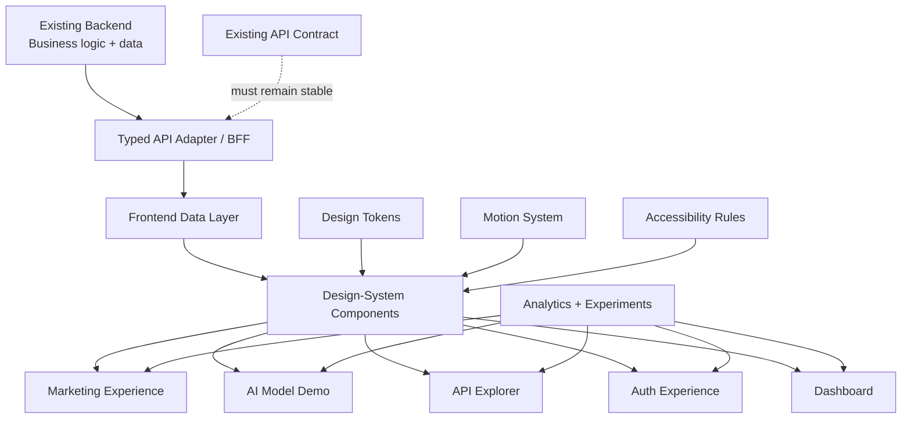
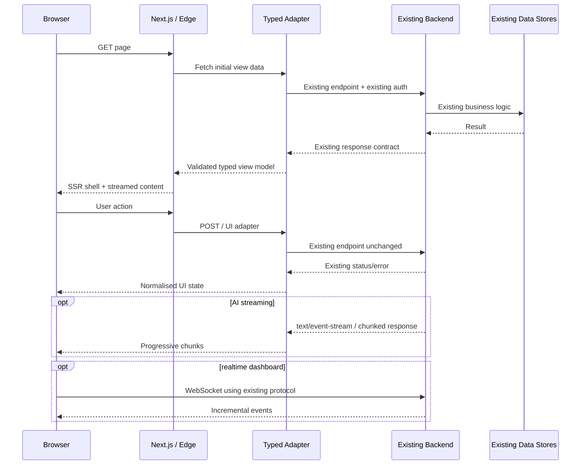

# Antigravity Blueprint for an Award-Calibre AI Website

## Executive summary

The redesign should be treated as a **frontend transformation around a frozen backend contract**, not as a rewrite. The safest target architecture is a new presentation layer, design system and interaction layer that consume the existing authentication, REST/RPC, streaming and WebSocket interfaces through a thin typed adapter or backend-for-frontend layer. That makes the visual product replaceable without changing business logic, data ownership, API semantics or security boundaries.

For an unconstrained greenfield frontend, my default recommendation is **Next.js + React + TypeScript + Tailwind CSS + Radix Primitives + Motion**, adding **GSAP ScrollTrigger only for a few deliberate cinematic sequences**, **TanStack Query** for client-side server state, **Zod** at API boundaries, **React Hook Form** for forms, **Storybook** for the component contract and **Playwright** for cross-browser, accessibility and visual-regression testing. Next.js' current architecture supports Server Components by default, client islands for interactive behaviour, streaming and component-level caching; its image tooling handles responsive sizing and image optimisation. citeturn0search12turn0search16turn0search24turn9search1

“UI/UX award-winning” should mean **award-calibre rather than visually extravagant**. Awwwards' current evaluation weights Design at 40%, UX/UI at 30%, Creativity at 20% and Content at 10%; therefore, an animation-heavy redesign that reduces clarity, accessibility or speed is strategically counterproductive. citeturn19search0turn19search10

The highest-priority transformation is:

| Priority | Action | Definition of success |
|---|---|---|
| **P0** | Freeze backend contracts | Current endpoints, auth, payload shapes, cookies, streaming protocols and error semantics continue working unchanged |
| **P0** | Establish measurable baseline | Core Web Vitals, accessibility, funnel, conversion/activation, bundle and API latency measured before redesign |
| **P0** | Build tokens + primitives first | Typography, spacing, colour, elevation, radii, motion and states are systematised rather than generated per page |
| **P1** | Redesign around user intent | Hero demonstrates the product; onboarding reaches first value quickly; AI uncertainty and provenance are visible |
| **P1** | Create one signature visual idea | A recognisable spatial/motion/imagery language rather than dozens of unrelated effects |
| **P1** | Separate public and application rendering | Static/server-rendered marketing pages; client interactivity only where required |
| **P1** | Treat accessibility/performance as design constraints | WCAG 2.2 AA and good Core Web Vitals are release gates, not post-launch fixes |
| **P2** | Instrument and experiment | Measure activation, task completion and errors; A/B-test meaningful hypotheses |
| **P2** | Prepare award submission only after product QA | Polish follows usability, not vice versa |

For performance, the non-negotiable field targets should match Google's “good” Core Web Vitals thresholds at the 75th percentile: **LCP ≤2.5 s, INP ≤200 ms and CLS ≤0.1**. citeturn3search2turn3search6turn3search12turn3search14

The conceptual relationship should be:



The critical principle is simple: **the frontend may reinterpret presentation; it must not reinterpret backend meaning.**

## Audit and experience blueprint

Before generating a single redesign, create a **baseline evidence pack**. It prevents an AI design agent from “improving” things by unknowingly deleting working states, changing authentication assumptions or replacing high-performing interactions.

**Current-site audit checklist**

| Area | Capture before redesign | What to diagnose | Redesign output |
|---|---|---|---|
| Assets | Logos/SVGs, icons, photos, video, illustration, favicons, OG images, app screenshots, fonts | Duplication, obsolete versions, compression, aspect ratios, usage/licensing | Asset manifest + approved/replace/retire status |
| Typography | Families, weights, sizes, line heights, letter spacing, fallbacks | Excess type styles, poor hierarchy, loading cost, legibility | 6–8 semantic text tokens |
| Colour | HEX/RGB/OKLCH values, gradients, opacity variants | Near-duplicate colours, contrast failures, inconsistent states | Semantic tokens: surface/text/border/accent/success/warning/error |
| Layout | Containers, grids, section spacing, content widths | Arbitrary spacing, weak rhythm, excessive width | Grid + spacing scale |
| Components | Every button/input/card/dialog/nav/table/toast/chart state | Duplicate patterns, missing loading/error/disabled states | Component inventory and canonical primitives |
| Responsive | Screens at ~320, 375, 768, 1024, 1440 and ultra-wide | Overflow, reordering, touch usability, typography jumps | Behaviour specification by container/breakpoint |
| Accessibility | Heading outline, landmarks, labels, names/roles, focus order, keyboard, contrast, zoom, reduced motion | WCAG 2.2 AA gaps | Remediation register with severity |
| API behaviour | Endpoints, methods, schemas, errors, pagination, rate limits, SSE/WebSockets | UI assumptions that are coupled to backend | Typed contract/adaptor |
| Auth | Login/signup/reset/MFA/SSO/session/logout flows | Cookie/token semantics, redirects, expiry, CSRF requirements | State diagram with zero contract changes |
| Performance | CWV field data, TTFB, JS/CSS KB, image weight, request count, fonts, long tasks | Largest bottlenecks | Performance budget |
| Product analytics | Acquisition → activation → core task → retention/conversion | Drop-offs and dead interactions | Measurement plan |
| SEO | Indexable routes, titles/descriptions, canonicals, sitemap, robots, schema, links | Client-only content and duplication | SEO matrix |
| Privacy | Analytics vendors, pixels, cookies/storage, replay, prompt/user data | Unnecessary personal-data collection | Data map + consent/masking rules |

WCAG 2.2 AA should be the baseline. Among its concrete requirements, ordinary text needs at least **4.5:1 contrast** and the new Target Size (Minimum) criterion generally establishes a **24×24 CSS-pixel minimum target**, subject to documented exceptions. citeturn20search2turn3search1

**Recommended house performance budgets**, stricter than simply “passing Lighthouse”:

| Budget | Marketing route | Authenticated application |
|---|---:|---:|
| LCP at p75 | ≤2.0 s target; 2.5 s hard ceiling | ≤2.5 s |
| INP at p75 | ≤150 ms target; 200 ms hard ceiling | ≤200 ms |
| CLS | ≤0.05 target; 0.1 ceiling | ≤0.1 |
| Initial compressed application JS | ≤170 KB preferred | ≤250 KB preferred |
| Above-fold imagery | ≤350 KB preferred | Context dependent |
| Fonts | ≤2 families; minimise loaded weights | Same |
| Hero animation | No blocking of LCP | N/A |
| Long interaction | Never visually freeze without feedback | Same |

The first three ceilings reflect Google's Core Web Vitals; the bundle/image numbers are **project budgets I recommend**, not web standards. citeturn3search2turn3search6turn3search12turn3search14

For the AI-specific journey, organise UX around **intent → evidence → control → outcome**. Google PAIR emphasises building an appropriate mental model of an AI system, communicating uncertainty, feedback and graceful failure; Microsoft's Human-AI Experience guidelines similarly treat initial expectations, uncertainty, corrections and behaviour over time as distinct UX concerns. citeturn12search0turn12search4turn12search23turn12search26turn12search1

| Pattern | Award-calibre implementation | Avoid |
|---|---|---|
| Hero | Outcome-led headline + one strong proof + usable miniature product demo | “AI-powered future” copy with decorative orb and no product |
| Onboarding | Ask for intent first; provide templates/sample data; get to first result rapidly | 6–10 mandatory explanatory screens |
| Empty states | Show an example and single high-value next action | Empty dashboard with “No data” |
| Explainability | Sources/evidence, AI label, uncertainty where meaningful, “Why?” details on demand | Pretending probabilistic output is definitive |
| Trust | Clear privacy/model/data handling explanation close to sensitive actions | Generic security badges without context |
| Human control | Edit, regenerate, undo, retry, compare and report feedback | Destructive autonomous actions |
| Failure | Preserve user's input; identify what failed; retry/fallback | “Something went wrong” with lost work |
| Data visualisation | Focused comparison, useful annotation, table alternative | Decorative 3D charts and unexplained scores |
| Microcopy | “Generate draft”, “Review sources”, “Try again”, “May contain errors” | Anthropomorphic claims such as “I know this is correct” |

IBM's Carbon for AI explicitly recommends identifying AI-generated content and providing a pathway from the AI indicator to explanation; its guidance cautions against using AI styling merely as decoration. citeturn12search2turn12search6

## Visual system, imagery and motion

The visual goal should be **one memorable art direction backed by an extremely disciplined interface system**. The strongest contemporary product references do not rely on every section being spectacular. Linear uses product-focused composition and restraint, Stripe combines marketing with unusually strong developer/product communication, while Anthropic's Claude experience keeps the proposition and interaction model prominent. citeturn18search21turn18search14turn18search2turn18search3

**Proposed design language**

Use a neutral-first palette with one recognisable chromatic signature; a variable sans serif for interface text; optionally one display face for campaign-sized headlines; generous but systematic whitespace; low-noise surfaces; precise 1px borders; restrained elevation; and a recurring spatial motif derived from the product itself—such as “latent space”, “signal → transformation → outcome”, or “human input → machine reasoning → human control”.

Do **not** make “AI aesthetic” synonymous with neon purple gradients, glassmorphism, glowing blobs and particle fields. Originality should emerge from the product's conceptual model.

**Imagery strategy**

| Asset type | Recommended role | Production rule |
|---|---|---|
| Real product UI | Primary hero proof | Use real states or realistic fixture data; make text readable |
| Editorial photography | Human/company story | Commission or license; preserve original licence metadata |
| Bespoke illustration | Explain invisible AI concepts | Build a reusable visual grammar, not one-off drawings |
| Generative imagery | Atmospheric hero art, conceptual transitions, campaign assets | Keep provenance record; human-art-direct and retouch |
| 3D/WebGL | One signature narrative only | Use only if product relevance justifies CPU/GPU/network cost |
| Stock imagery | Secondary/supporting | Avoid generic “person staring at hologram” AI imagery |

For generated assets, maintain an asset-provenance record containing **model/service, date, prompt, source inputs, licence/T&Cs at creation, human edits and approval owner**. Copyright status of AI-generated material is jurisdiction-dependent: the U.S. Copyright Office's dedicated AI study includes a 2025 report specifically addressing copyrightability of generative-AI output, so generated imagery should not automatically be treated as equivalent to commissioned human-authored exclusive artwork. citeturn20search0turn20search5

For the final brand hero, my preference is therefore **product-first + bespoke/generated atmosphere**, rather than making the generated illustration itself the product claim.

**Motion system**

| Technique | Best use | Strength | Risk / rule |
|---|---|---|---|
| CSS transitions / keyframes | Hover, focus, simple entrance | Minimal runtime | Keep state changes functional without animation |
| CSS scroll-driven animation | Progressive decoration | Browser-driven, little JS | Not yet equally available across all browsers; progressive enhancement only. citeturn7search3turn7search15 |
| Motion | Cards, layout transitions, gestures, scroll-linked UI | Excellent React integration and reduced-motion handling | Default library for product UI. citeturn7search0turn7search4turn7search13 |
| GSAP + ScrollTrigger | Pinned narratives, scrubbed hero sequences | Fine-grained scrub/pin/snap control | Restrict to 1–2 high-value sequences; complexity rises quickly. citeturn7search5 |
| Lottie | Small branded vector loops | Designer-friendly AE→JSON workflow | Large/complex files can undermine the reason for using vector animation. citeturn7search2 |
| WebGL/Three.js | Spatial hero/explorable demo | Maximum visual differentiation | Separate optional enhancement; never block core UX |

Motion's accessibility APIs support user reduced-motion preferences, including replacing transform/layout animation while retaining less disruptive properties; GSAP likewise provides media-query handling for `prefers-reduced-motion`. citeturn7search4turn7search1

My motion tokens would start approximately here:

```css
:root {
  --motion-instant: 100ms;
  --motion-fast: 160ms;
  --motion-ui: 220ms;
  --motion-emphasis: 420ms;
  --ease-out: cubic-bezier(.22, 1, .36, 1);
}

.interactive {
  transition:
    transform var(--motion-fast) var(--ease-out),
    opacity var(--motion-ui) ease,
    border-color var(--motion-ui) ease;
}

.interactive:hover {
  transform: translateY(-2px);
}

@media (prefers-reduced-motion: reduce) {
  *,
  *::before,
  *::after {
    scroll-behavior: auto !important;
    animation-duration: 0.01ms !important;
    animation-iteration-count: 1 !important;
  }

  .interactive:hover {
    transform: none;
  }
}
```

The reduced-motion media feature communicates the user's operating-system preference to minimise non-essential motion. citeturn3search3

Parallax should be subtle background depth rather than text that moves independently from reading. Scroll-triggered content must remain visible and understandable with JavaScript disabled where practical and reduced motion enabled. Auto-playing video/animation needs a pause mechanism where required, and flashing content must remain within WCAG limits. citeturn20search2

## Architecture, stack and backend integration

**Framework comparison**

| Option | Strengths for this project | Trade-offs | Verdict |
|---|---|---|---|
| **React + Next.js** | Server Components, client islands, streaming, caching, image optimisation; fits highly interactive dashboards and marketing pages in one app. citeturn0search12turn0search16turn0search24turn9search1 | Requires discipline around server/client boundaries | **Recommended default** |
| **Vue + Nuxt** | Nuxt supports universal, client-side and hybrid rendering; strong alternative for Vue teams. citeturn1search0turn1search3 | Different ecosystem from the React-oriented component plan below | Excellent alternative |
| **Svelte + SvelteKit** | Clean component model; SvelteKit can stream non-essential data after initial navigation. citeturn1search1turn1search4 | Recreate React-specific integrations/components if current ecosystem is React-centric | Excellent for a compact specialist team |

**UI-layer comparison**

| Library strategy | Advantages | Limitations | Best fit |
|---|---|---|---|
| **Tailwind + Radix** | Tailwind exposes theme variables/tokens; Radix handles ARIA, keyboard navigation and focus for primitives. citeturn2search8turn2search3turn2search15 | More design work is yours | **Best award-calibre choice** |
| **Chakra UI** | Broad set of accessible, styleable components, including skip-navigation and focus primitives. citeturn15search2turn15search8 | Strong custom art direction requires systematic theming | Fast product development |
| **Material UI** | Comprehensive React implementation of Material Design. citeturn2search18 | Material visual language can dominate custom brand expression | Dense enterprise/admin UI |
| Fully custom CSS | Maximum control | Highest a11y/state/maintenance burden | Only for selected signature components |

The ideal composition is not “Tailwind everywhere”. **Radix owns interaction semantics; Tailwind/design tokens own appearance; bespoke CSS/WebGL owns only signature visuals.**

**Recommended supporting libraries**

| Concern | Choice | Why |
|---|---|---|
| Server/client framework | Next.js + TypeScript | Rendering flexibility and streaming |
| Accessible primitives | Radix UI | Focus, keyboard and ARIA foundations. citeturn2search3turn2search31 |
| Styling | Tailwind + CSS custom properties | Fast token-driven art direction. citeturn2search8 |
| UI motion | Motion | Product/layout/gesture motion + reduced-motion facilities. citeturn7search4turn7search13 |
| Cinematic motion | GSAP/ScrollTrigger | Pin/scrub/snap when actually justified. citeturn7search5 |
| Remote state | TanStack Query | Cache lifecycle, stale/refetch and explicit invalidation. citeturn10search2turn10search10 |
| Runtime contracts | Zod | TypeScript-first runtime validation at untrusted boundaries. citeturn9search0 |
| Forms | React Hook Form | Efficient form-state management without imposing a UI library. citeturn8search3turn8search23 |
| Component workshop | Storybook | Isolated hard-to-reach UI states; current tooling also exposes component/a11y workflows to AI agents via MCP. citeturn13search12turn13search1turn13search9 |
| E2E/a11y/visual | Playwright | Chromium, Firefox and WebKit; accessibility and screenshot testing. citeturn13search17turn13search0turn13search8 |
| Images | `next/image` or equivalent CDN pipeline | Responsive sizing, format optimisation, layout stability and lazy loading. citeturn9search1turn9search3 |
| CMS | Existing CMS, or optional headless CMS | Marketing/editorial content only; transactional data stays in the backend |

**Backend compatibility pattern**



The adapter is explicitly **anti-corruption**, not a second business-logic layer. It may validate schemas, rename data for presentation and normalise error display, but it should not invent permissions, pricing rules, model behaviour or persistence logic.

**Hero**

```html
<section class="hero" aria-labelledby="hero-title">
  <div class="hero__copy">
    <p class="eyebrow">Your product category</p>

    <h1 id="hero-title">
      Turn complex input into
      <span class="accent">an actionable result.</span>
    </h1>

    <p class="lede">
      Explain the concrete outcome in one sentence, not the underlying AI hype.
    </p>

    <div class="hero__actions">
      <a class="button primary" href="/app">Try the product</a>
      <a class="button secondary" href="#demo">See it work</a>
    </div>
  </div>

  <div class="hero__demo" id="demo" aria-label="Interactive product preview">
    <!-- Render a real lightweight product state here -->
  </div>
</section>
```

```css
.hero {
  width: min(1200px, calc(100% - 2rem));
  min-height: min(820px, 90svh);
  margin-inline: auto;
  display: grid;
  grid-template-columns: minmax(0, .85fr) minmax(0, 1.15fr);
  align-items: center;
  gap: clamp(2rem, 6vw, 7rem);
}

.hero h1 {
  max-width: 12ch;
  font-size: clamp(3rem, 7vw, 7rem);
  line-height: .92;
  letter-spacing: -.055em;
}

@media (max-width: 800px) {
  .hero {
    grid-template-columns: 1fr;
    min-height: auto;
    padding-block: 6rem 3rem;
  }
}
```

**Feature cards**

A feature card should communicate **problem → interaction → observable result**, not contain an icon and three lines of generic copy.

```html
<ul class="feature-grid" role="list">
  <li class="feature-card">
    <p class="feature-card__index">01</p>
    <h2>Inspect before you trust</h2>
    <p>Expose the evidence, sources or intermediate state behind an AI result.</p>
    <a href="/docs/explainability">How it works <span aria-hidden="true">→</span></a>
  </li>
</ul>
```

```css
.feature-grid {
  display: grid;
  grid-template-columns: repeat(auto-fit, minmax(min(280px, 100%), 1fr));
  gap: .75rem;
}

.feature-card {
  padding: clamp(1.25rem, 3vw, 2.25rem);
  border: 1px solid var(--border);
  border-radius: var(--radius-lg);
  background: var(--surface);
}
```

**Interactive model demo with POST streaming**

`fetch()` exposes streamed response bodies through `ReadableStream`, making it appropriate for POST-based AI generation; `EventSource` is a persistent one-way HTTP event stream and is more natural for server→client GET-style updates. citeturn14search9turn14search1turn14search5

```tsx
"use client";

import { useRef, useState } from "react";

export function ModelDemo() {
  const [output, setOutput] = useState("");
  const [status, setStatus] =
    useState<"idle" | "running" | "error">("idle");
  const controller = useRef<AbortController | null>(null);

  async function generate(prompt: string) {
    controller.current?.abort();
    controller.current = new AbortController();

    setStatus("running");
    setOutput("");

    try {
      const response = await fetch("/api/ui/model-demo", {
        method: "POST",
        credentials: "include",
        headers: { "Content-Type": "application/json" },
        body: JSON.stringify({ prompt }),
        signal: controller.current.signal
      });

      if (!response.ok || !response.body) {
        throw new Error(`Request failed: ${response.status}`);
      }

      const reader = response.body.getReader();
      const decoder = new TextDecoder();

      for (;;) {
        const { value, done } = await reader.read();
        if (done) break;

        setOutput(current =>
          current + decoder.decode(value, { stream: true })
        );
      }

      setStatus("idle");
    } catch (error) {
      if ((error as DOMException).name !== "AbortError") {
        setStatus("error");
      }
    }
  }

  return (
    <section aria-labelledby="demo-title">
      <h2 id="demo-title">Try a real example</h2>

      {/* prompt form omitted for brevity */}

      <output aria-live="polite" aria-busy={status === "running"}>
        {output}
      </output>

      {status === "running" && (
        <button onClick={() => controller.current?.abort()}>
          Stop generating
        </button>
      )}

      {status === "error" && (
        <p role="alert">
          Generation stopped unexpectedly. Your input has been preserved.
        </p>
      )}
    </section>
  );
}
```

`AbortController` is the browser's standard mechanism for cancelling web requests. citeturn14search17

**API explorer**

```ts
import { z } from "zod";

const ApiResult = z.object({
  id: z.string(),
  status: z.string(),
  result: z.unknown()
});

export async function runExample(payload: unknown) {
  const response = await fetch("/api/ui/explorer", {
    method: "POST",
    credentials: "include",
    headers: {
      "Content-Type": "application/json",
      "X-Client": "web-api-explorer"
    },
    body: JSON.stringify(payload)
  });

  const requestId = response.headers.get("x-request-id");
  const raw = await response.json().catch(() => null);

  if (!response.ok) {
    throw {
      status: response.status,
      requestId,
      message: raw?.message ?? "The API request failed."
    };
  }

  return ApiResult.parse(raw);
}
```

Show request method, URL/path, headers with secrets masked, request body, response status, request ID, response body, elapsed time and a **Copy as cURL/JS/Python** affordance. Never expose backend secrets in browser-generated examples.

**Authentication**

Do not redesign authentication architecture merely because the UI changes. Preserve the current identity provider, cookies/tokens, session expiration, MFA and redirect semantics. Where the backend already supports secure HTTP-only session cookies, keep credentials inaccessible to presentation JavaScript; continue existing CSRF protections for state-changing requests. Broken authentication and object-level authorisation remain central API-security risks, so UI hiding must never be treated as authorisation. citeturn5search9

```ts
export async function login(email: string, password: string) {
  const response = await fetch("/api/ui/auth/login", {
    method: "POST",
    credentials: "include",
    headers: { "Content-Type": "application/json" },
    body: JSON.stringify({ email, password })
  });

  if (response.status === 401) {
    throw new Error("The email or password was not accepted.");
  }

  if (!response.ok) {
    throw new Error("Sign-in is temporarily unavailable.");
  }

  // Do not copy a server-managed session secret into localStorage.
  return response.json();
}
```

The UX needs explicit states for normal login, validation errors, invalid credentials, rate limiting, MFA challenge, expired session, password reset, SSO redirect, account lock/suspension, network failure and successful return to the user's original destination.

**Dashboard with cache + realtime**

TanStack Query can manage server-state caching and invalidation while WebSockets handle genuinely realtime deltas. Standard browser WebSocket is bidirectional, although MDN notes that the stable `WebSocket` API itself does not provide backpressure, which matters for very high-frequency streams. citeturn10search2turn10search10turn8search0

```tsx
const jobs = useQuery({
  queryKey: ["jobs"],
  queryFn: () =>
    fetch("/api/ui/jobs", { credentials: "include" })
      .then(r => {
        if (!r.ok) throw new Error("Unable to load jobs");
        return r.json();
      }),
  staleTime: 30_000
});

useEffect(() => {
  const ws = new WebSocket(REALTIME_URL);

  ws.addEventListener("message", event => {
    const change = JSON.parse(event.data);

    if (change.type === "job.updated") {
      queryClient.setQueryData(["jobs"], (current: Jobs | undefined) =>
        current ? applyJobPatch(current, change.payload) : current
      );
    }
  });

  return () => ws.close();
}, [queryClient]);
```

Use polling for low-frequency information, SSE for one-way progress/events, fetch streaming for POST-based model output and WebSockets only for genuinely bidirectional/realtime interactions. This keeps operational complexity proportional to the problem. citeturn14search1turn14search9turn8search0

## Antigravity prompt system

In this report, **“antigravity prompt” is a project-specific operating contract**, not an established industry standard. Its job is to stop an AI designer or coding agent from gravitating towards generic AI-site aesthetics, unnecessary rewrites and backend-breaking shortcuts.

Use **ANTIGRAVITY** as the acceptance model:

| Letter | Rule |
|---|---|
| **A — Audit first** | Understand existing screens, assets, metrics and behaviour before changing anything |
| **N — No contract breakage** | Preserve endpoints, auth, payloads and backend semantics |
| **T — Tokens before pages** | Establish design tokens and primitives before generating screens |
| **I — Intent before ornament** | Every screen begins with user intent and desired outcome |
| **G — Graceful AI** | Expose uncertainty, loading, failure, provenance and human control |
| **R — Responsive by construction** | Specify behaviour from small mobile to wide desktop |
| **A — Accessible motion** | Keyboard/screen-reader/reduced-motion behaviour is part of the animation spec |
| **V — Visual narrative** | Use one recognisable art direction and signature visual idea |
| **I — Instrument everything meaningful** | Measure task completion, activation, latency and errors |
| **T — Test contracts and experience** | Visual, interaction, accessibility, browser, API and regression tests |
| **Y — Yield implementation-ready artefacts** | Components, tokens, states, tests and integration notes—not just screenshots |

**Master antigravity transformation prompt — run first**

```text
ROLE
You are a principal product designer, interaction designer and frontend
architecture partner redesigning an existing production AI product.

OBJECTIVE
Transform the supplied website into an award-calibre product experience while
preserving 100% functional compatibility with the current backend.

INPUTS
- Existing pages/screens: {{SCREENS_OR_URLS}}
- Existing source/components: {{SOURCE_CONTEXT}}
- Brand assets/fonts: {{ASSET_MANIFEST}}
- API/OpenAPI/GraphQL docs: {{API_CONTRACT}}
- Authentication behaviour: {{AUTH_CONTRACT}}
- Streaming/realtime protocols: {{STREAMING_CONTRACT}}
- Existing analytics: {{BASELINE_METRICS}}
- Required business flows: {{CRITICAL_FLOWS}}

ABSOLUTE INVARIANTS
1. Do not rename, remove, invent or change backend endpoint semantics.
2. Do not change request/response schemas, authentication/session behaviour,
   permission rules, persistence or business logic.
3. When the new UI needs another shape, create a typed presentation adapter.
4. Every existing critical user flow must have a mapped equivalent.
5. Never treat hidden UI as authorisation.
6. Do not put private API credentials in client code.
7. Preserve URL/SEO equity unless a redirect plan is explicitly supplied.
8. Never delete loading, empty, partial, error, rate-limit, expired-session
   or offline states.

QUALITY TARGET
- WCAG 2.2 AA
- LCP <= 2.5 s p75
- INP <= 200 ms p75
- CLS <= 0.1 p75
- Keyboard-complete experience
- Full prefers-reduced-motion mode
- Mobile-first responsive behaviour
- No ornamental effect may block or delay a primary task

DESIGN DIRECTION
Create one coherent, memorable visual concept derived from the product's
purpose. Avoid generic AI tropes: indiscriminate purple gradients, glowing
orbs, glass panels, particle noise, fake neural networks and meaningless
"future of AI" copy.

The product itself should be the hero evidence.

AI UX
For every AI interaction specify:
- what the system can do
- what input it needs
- loading/progress behaviour
- streaming behaviour
- source/evidence treatment
- uncertainty or limitations where applicable
- editable/regeneratable states
- user feedback/control
- graceful error/fallback
- data/privacy implication

OUTPUT IN THIS ORDER
A. audit findings
B. user journey and information architecture
C. design principles
D. semantic design tokens
E. component inventory
F. desktop + tablet + mobile specifications
G. motion specification
H. complete component state matrix
I. endpoint-to-component integration map
J. accessibility annotations
K. performance implications
L. analytics events
M. migration risks
N. acceptance-test checklist

Do not produce final polished screens until A-E are internally consistent.
Explicitly label every assumption.
```

This sequence mirrors human-AI design guidance that expectations, explanations, feedback and failure recovery need deliberate treatment rather than being appended to a finished interface. citeturn12search0turn12search1turn12search26

**Designer / Figma-agent prompt**

```text
You are the lead digital product designer.

Using the approved ANTIGRAVITY contract, construct a cohesive design system
and high-fidelity experience for {{PRODUCT}}.

DESIGN GOAL
"Quiet precision with one unforgettable moment."

FIRST CREATE
- colour roles rather than arbitrary colours
- fluid typography scale
- spacing/grid system
- border/radius/elevation tokens
- focus, hover, pressed, disabled and loading states
- motion tokens
- iconography rules
- chart/data-viz rules

THEN DESIGN
1. outcome-first home hero containing a real product interaction
2. trust/explanation layer directly after proof
3. feature narratives showing actual input -> processing -> outcome
4. low-friction onboarding
5. interactive model playground
6. API explorer/documentation experience
7. authentication and recovery flows
8. data-dense dashboard
9. mobile equivalents

FOR EVERY FRAME
Annotate:
- user intention
- component names
- responsive behaviour
- endpoint/data dependency
- keyboard behaviour
- screen-reader labels/live regions
- reduced-motion alternative
- loading/empty/error/permission states
- analytics event
- implementation difficulty: S/M/L

VISUAL CONSTRAINT
One signature visual grammar only. Every decorative object must originate
from that grammar. Do not imitate a named designer, studio or competitor.

DELIVERY
Provide variables/tokens, component variants, Auto Layout constraints,
interactive prototypes and developer-ready annotations.
```

**Frontend coding-agent prompt**

```text
You are a senior frontend engineer working inside an existing production
repository. Optimise for compatibility and reviewability, not code volume.

BEFORE WRITING CODE
1. Map framework, routes and dependency versions.
2. Locate existing API/auth clients and environment handling.
3. Identify current backend contract tests.
4. Inventory shared components.
5. Produce a proposed file-level change plan.
6. Flag any dependency addition before using it.

IMPLEMENTATION RULES
- TypeScript strict mode.
- Keep backend endpoint contracts unchanged.
- Route all server responses through typed schemas/adapters.
- Prefer semantic HTML and native browser behaviour.
- Use Server Components/static rendering for non-interactive content.
- Add Client Components only at interaction boundaries.
- Never expose server secrets in the browser.
- Preserve existing auth/cookies/CSRF/CORS behaviour.
- Implement loading, empty, error and retry states.
- Abort obsolete streaming requests.
- Respect prefers-reduced-motion.
- No animation may alter logical DOM order or keyboard order.
- Lazy-load heavy visual modules.
- Prevent layout shift by reserving media dimensions.
- No new dependency when platform CSS/HTML solves the problem cleanly.

FOR EVERY COMPONENT RETURN
- component code
- Storybook stories for all states
- keyboard/accessibility expectations
- test cases
- endpoint dependency
- loading/error strategy
- performance notes
- migration risk

BEFORE MARKING COMPLETE RUN
typecheck
lint
unit/component tests
Playwright critical flows
accessibility scan
visual regression
performance budget
production build

Do not alter backend code unless explicitly authorised.
```

Storybook's current agent-facing tooling is particularly useful here because an AI coding agent can operate against actual components and accessibility tests instead of hallucinating an independent design system. citeturn13search1turn13search9

**Generative-image prompt template**

```text
PURPOSE
Create a {{HERO / SECTION / EDITORIAL}} image for {{PRODUCT}}.

CONCEPT
Visualise "{{CORE_PRODUCT_CONCEPT}}" through {{METAPHOR}}, communicating
{{EMOTION}} without depicting generic artificial-intelligence imagery.

ART DIRECTION
- composition: {{COMPOSITION}}
- camera/perspective: {{PERSPECTIVE}}
- material language: {{MATERIALS}}
- lighting: {{LIGHTING}}
- palette: {{APPROVED_TOKENS}}
- negative space: reserve {{LEFT/RIGHT}} {{40%}} for responsive headline
- crop-safe focal point for 16:9, 4:5 and 1:1 adaptations
- premium editorial finish
- restrained detail at small viewport sizes

BRAND RULES
- no text rendered inside the image
- no logos unless supplied as approved source material
- do not imitate a named living artist, design studio or competitor
- no cliché robot heads, circuit brains, blue holograms or random neon nodes
- no recognisable third-party IP
- preserve brand palette and established visual grammar

TECHNICAL
Generate at sufficient resolution for the largest intended display.
Keep subject separable from background for art direction and responsive crops.

RETURN / RECORD
model/version
prompt
seed or generation ID where available
source/reference assets
date
editorial modifications required
licensing/provenance note
```

The final image should then be optimised through the regular asset pipeline rather than serving the model's raw output. Next.js' image component, for example, automatically handles device-appropriate sizing, modern formats and layout stability. citeturn9search1

## Quality gates, compliance and release engineering

**Performance and SEO**

Public marketing pages should be rendered statically or server-side where possible and hydrate only the genuinely interactive islands. Next.js Server Components support server-side fetching and streaming; Google's JavaScript SEO documentation explains that JavaScript sites are crawled, rendered and indexed in separate phases, and Google recommends server/static rendering or hydration rather than its older dynamic-rendering workaround. citeturn0search12turn15search1turn15search7

SEO release gates should include semantic headings and landmarks; one useful canonical URL per piece of content; server-rendered titles/descriptions; Open Graph/social imagery; indexable internal links; sitemap/robots verification; alternate-language metadata where relevant; and only applicable, truthful JSON-LD. Google states that structured data helps it understand page meaning but does **not** guarantee a rich result, and markup should represent user-visible page content. citeturn16search3turn16search17

Lazy loading should be reserved for non-critical/off-screen content; Google explicitly warns that improperly implemented lazy loading can hide content from Search. citeturn15search10

The build should fail when a proposed redesign exceeds agreed budgets. Suggested CI sequence:

```text
PR
 ↓
TypeScript / lint / formatting
 ↓
Unit + schema/adapter tests
 ↓
Storybook component build
 ↓
Accessibility checks
 ↓
Playwright Chromium + Firefox + WebKit
 ↓
Visual regression
 ↓
Production build
 ↓
Bundle-size budget
 ↓
Lighthouse / CWV lab guardrails
 ↓
Dependency/security scan
 ↓
Preview deployment
 ↓
Human UX + content + motion review
 ↓
Feature-flagged canary
 ↓
Production
```

Lighthouse evaluates categories including performance, accessibility and SEO, while Playwright can run against Chromium, Firefox and WebKit and supports screenshot/accessibility testing. citeturn13search2turn13search17turn13search0turn13search8

A strict Content Security Policy should be part of production hardening; CSP restricts which resources a document may load and is principally used as a defence against attacks including XSS. citeturn16search1

**Testing and product analytics**

Do not A/B-test superficial visual variants first. Test hypotheses that could change behaviour:

| Experiment | Primary metric | Guardrails |
|---|---|---|
| Interactive hero vs static product screenshot | Qualified CTA → first-value rate | LCP, mobile bounce/errors |
| Intent-first onboarding vs account-first | Activation/completion | Support/error rate |
| Example prompt/template vs empty composer | First successful result | Regeneration/error rate |
| Inline explainability vs hidden details | Trust/useful-result rating | Task time |
| Progressive API explorer vs docs-only | Successful first API call | API errors |
| Compact vs expanded dashboard | Task completion | Misclicks/support |

Use feature flags for controlled rollout and experiments rather than deploying irreversible variants. PostHog, for example, ties feature flags to gradual rollouts and experiments; its experimentation system supports targeted segments and holdouts. citeturn17search3turn17search6

Heatmaps and session replay are **diagnostic tools, not product KPIs**. Microsoft's Clarity records the DOM context and actions such as mouse movement, clicks and scrolling to recreate interactions; therefore, sensitive AI prompts, personal records, credentials, API keys and other private content must be masked/excluded according to the tool's privacy controls and your lawful basis. citeturn17search1turn17search19

For field performance, use a real-user-monitoring service rather than Lighthouse alone. Vercel Speed Insights, for example, reports field data based on Core Web Vitals. citeturn17search2turn17search5

**Accessibility release checklist**

| Gate | Required outcome |
|---|---|
| Semantics | Logical HTML landmarks/headings before ARIA |
| Keyboard | Every workflow achievable without pointer |
| Focus | Highly visible focus; correct restoration after dialogs |
| Contrast | WCAG 2.2 AA; body text ≥4.5:1 subject to WCAG exceptions |
| Touch | ≥24×24 CSS px minimum under WCAG criterion/exception rules; prefer larger primary controls |
| Forms | Persistent labels, instructions, field-specific errors |
| Errors | Error summary + focus strategy for long forms |
| Async AI | Appropriate `aria-live`; no character-by-character screen-reader flood |
| Dialogs | Focus enters/traps/restores correctly; Escape works where appropriate |
| Charts | Text summary/table alternative; colour is never sole encoding |
| Images | Useful alternative text or explicitly decorative |
| Zoom/reflow | Functional at 200–400% zoom/reflow scenarios |
| Motion | Full reduced-motion path |
| Media | Captions/transcripts where applicable |
| Drag operations | Alternative non-drag interaction where WCAG requires it |
| Automated testing | axe-style checks in CI plus manual assistive-tech review |
| Manual testing | Screen reader + keyboard + zoom + reduced motion on real browsers |

WCAG 2.2 is the authoritative baseline; automated tooling can detect issues such as colour contrast, missing accessible names and duplicate IDs, but automation cannot establish complete accessibility on its own. citeturn20search2turn13search0

**Privacy**

For users in India, map the redesign against the Digital Personal Data Protection framework and the **Digital Personal Data Protection Rules, 2025**; MeitY published the Rules as the implementing framework for India's DPDP Act. citeturn6search0turn6search19turn6search3

For EEA users, apply GDPR principles including purpose limitation, data minimisation, storage limitation and appropriate security/accountability. citeturn4search2turn4search6

The frontend privacy checklist should therefore require: a data inventory per analytics/AI feature; documented purpose and retention; consent where legally required; no prompt/session replay capture by default; IP/user-ID minimisation where possible; masking of form fields and generated sensitive output; deletion/export hooks compatible with the existing backend; vendor/subprocessor register; cookie/storage inventory; separate production/test datasets; and explicit review before adding a new tracker. This is a product-engineering checklist rather than jurisdiction-specific legal advice. citeturn4search2turn6search0

## Delivery roadmap, staffing and references

With no budget or deadline constraint, I would choose an **approximately ten-week parallel design/engineering programme** rather than an artificial “redesign sprint”. The ranges below are planning estimates and should be recalibrated once the actual repository, site assets and endpoints are audited.

| Period | Work | Exit criteria |
|---|---|---|
| Weeks 1–2 | Repository/API/site audit, analytics baseline, user journeys, accessibility/performance review | Frozen backend contract + baseline scorecard |
| Weeks 2–3 | Art direction, UX architecture, content hierarchy, token exploration | One approved visual direction |
| Weeks 3–4 | Design system, Storybook architecture, hero/prototype experiments | Core primitives and states approved |
| Weeks 4–7 | Marketing pages + onboarding + auth + model demo + API explorer | Feature-complete staging |
| Weeks 6–8 | Dashboards, streaming/realtime, responsive polish, motion | Critical flows integrated |
| Weeks 8–9 | A11y, performance, SEO, browser, visual regression, security | Quality gates green |
| Weeks 9–10 | Analytics, A/B framework, canary, final polish and launch | Production release |
| Post-launch | Funnel analysis, field CWV, user feedback, award-submission polish | Evidence-led optimisation |

**Skill and hiring matrix**

| Role | Seniority | Estimated hours | Primary responsibility |
|---|---|---:|---|
| Product/UX lead | Principal/Senior | 140–180 | Journeys, information architecture, usability, design governance |
| Product/visual designer | Senior | 180–240 | Art direction, design system, screens, prototypes |
| Motion designer | Senior/specialist | 80–120 | Motion grammar, GSAP/Lottie assets, reduced-motion variants |
| Frontend technical lead | Staff/Senior | 240–300 | Architecture, design system, integration, quality |
| Frontend engineer | Mid-senior/Senior | 220–280 | Components, dashboards, responsive implementation |
| Backend integration engineer | Senior, part-time | 80–120 | Contract mapping, streaming/auth/realtime validation |
| UX/content designer | Senior, part-time | 50–80 | Hero, onboarding, errors, AI microcopy |
| QA/accessibility specialist | Senior | 100–140 | Assistive tech, browsers, regression and edge states |
| Performance/DevOps engineer | Senior, part-time | 60–90 | CI/CD, RUM, budgets, caching, deployment |
| Product/project manager | Senior, part-time | 80–120 | Scope, dependencies, acceptance, rollout |
| **Estimated total** |  | **1,230–1,670 h** | Parallel programme |

The deliverable set should be tangible rather than a presentation deck: **audit scorecard; API compatibility matrix; journey map; content model; Figma token library; component/state inventory; responsive designs; motion specification; generative-asset provenance ledger; Storybook; production frontend; automated tests; accessibility report; performance/SEO report; analytics event schema; experiment backlog; migration/rollback plan; and deployment runbook**.

**Reference patterns worth studying**

| Reference | Study this—not its surface style |
|---|---|
| **Awwwards evaluation system** | The actual balance of visual design, UX, creativity and content; useful as the award-quality rubric. citeturn19search0 |
| **Awwwards AI in Design Report 2026** | A current August 2026 benchmark for contemporary AI/digital presentation rather than copying older award trends. citeturn19search13 |
| **Linear** | Product-as-story, disciplined hierarchy and restraint rather than decorative complexity. citeturn18search21turn18search1 |
| **Stripe** | Developer experience, documentation, API communication and product demonstrations. citeturn18search2turn18search6turn18search10 |
| **Claude / Anthropic** | Clear AI proposition and product-oriented storytelling. citeturn18search3 |
| **Google PAIR Guidebook** | AI mental models, uncertainty, user control, explanations and graceful failure. citeturn12search0turn12search4turn12search26 |
| **IBM Carbon for AI** | AI labelling and explainability integrated into a mature design system. citeturn12search2turn12search6 |
| **Microsoft HAX** | Evidence-based human-AI interaction guidelines across first use, normal operation, failure and learning over time. citeturn12search1turn12search27 |
| **Radix Primitives** | Interaction/accessibility foundations beneath a completely custom visual system. citeturn2search3turn2search15 |

The important synthesis is that an award-calibre AI product should **look distinctive because its product idea has been given a distinctive visual language**, not because the frontend contains more effects. Google PAIR, Microsoft HAX and Carbon all point towards transparency, control and graceful failure for AI experiences, while Awwwards gives more combined weight to design and UX/UI than creativity alone. citeturn12search0turn12search1turn12search2turn19search0

Once the site's actual assets and endpoint definitions are supplied, the first implementation artefact should therefore be a **backend-compatibility ledger** with one row per existing endpoint and user flow:

| Existing contract | Current consumer | New component | Adapter required? | Auth unchanged? | Loading/error states | Regression test |
|---|---|---|---|---|---|---|
| `POST /…` | Current form | New model composer | Yes/No | ✓ | Defined | Playwright/API |
| `GET /…` | Dashboard | New data panel | Yes/No | ✓ | Defined | Contract + visual |
| Stream `/…` | Current output | New model result | Yes/No | ✓ | Cancel/retry | Stream fixture |
| WebSocket `/…` | Live view | New realtime panel | Yes/No | ✓ | reconnect/stale | Protocol fixture |
| Auth `/…` | Login | New auth shell | No semantic change | ✓ | MFA/expiry/errors | Full E2E |

That ledger is the boundary between **creative freedom above the line and zero-regression discipline below it**. It is the mechanism that allows the “antigravity” prompt to be ambitious about typography, interaction, motion, imagery and narrative while remaining conservative about the backend—the combination most likely to produce a genuinely exceptional product rather than a beautiful but fragile redesign.